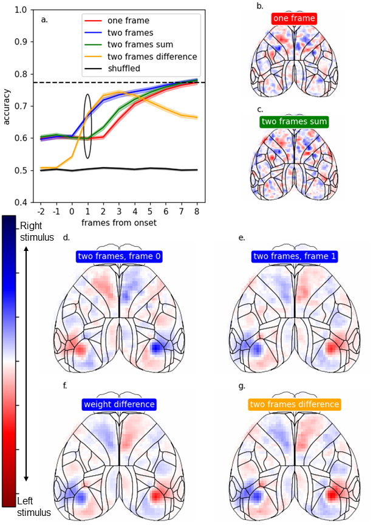

I'm a data scientist with a background in neuroscience excited about exploring data to answer interesting questions and solve business problems. I'm especially interested in biotech and tech, but I can get excited about almost any challenging field.

Experience
======
- [The Data Incubator](https://www.thedataincubator.com/programs/data-science-fellowship/) — Data Science Fellow
    - Learned broad set of Data Science tools
    - Completed capstone project predicting rental income from data scraped from AirBnB by combining NLP and XGBoost regression
    - Project selected for the prestigious Capstone Showcase presentation
- Cold Spring Harbor Laboratory – Graduate researcher
    - Led individual project aimed at understanding the basic neuroscience of decision-making
    - Designed and conducted experiments, and created automated pipeline for data preprocessing and transfer
    - Created analysis scripts including feature engineering, Machine Learning, and statistical testing, to create figures for a manuscript
- [International Brain Laboratory](https://www.internationalbrainlab.com/) – Researcher
    - Collaborated with a 20+ member team to create the first standardized behavioral task in systems neuroscience
    - Co-authored a [paper in eLife](https://elifesciences.org/articles/63711) including the 200+ pages of detailed technical procedures
    - Contributed to the [largest single-cell electrophysiology dataset to date](https://www.biorxiv.org/content/10.1101/2022.05.09.491042v2)
- Colby College Research Methods and Statistics in Psychology TA
    - Assisted students with coursework, experimental design, and hypothesis testing

Recent Projects
======
 
Ongoing work -> Web app for optimized income from short-term rentals
----
- scraped ~500k AirBnB listings from 30 cities 
- created preprocessing pipeline to seamlessly filter and clean data
- trained XGBoost model to predict occupancy rates for each listing using all availbale data, including NLP of text fields and feature engineering of location, price, etc.
- created webapp to take user input and predict monthly earnings for the details of a user's listing
- allows users to try different listing details (description, name, # guests, etc.) to optimize income
- [Code here](https://github.com/cskrasniak/rentals)

Cortex-wide neural imaging in behaving mice
----
- Found that neural information predictive of behavior is both distributed throughout the brain, but specifically localized at different times
- Collected 100Tb of imaging data
- Implemented automated preprocessing and data transfer (batch script executing python and MATLAB scripts)
- Created multi-stage analytic pipeline (PCA, custom curve fitting, feature engineering, cross-validated logistic regression, Bernoulli testing, permutation testing) to create publication-ready figures (matplotlib, seaborn)
- Presented at International Brain Lab Annual Meeting with manuscript in preparation
- [Code here](https://github.com/cskrasniak/wfield/tree/master/notebooks)

Model decoding weights at frame 1 (66ms following stimulus onset). Stimulus decoding accuracy for different models aligned to stimulus onset. (a) Comparison of different decoding models. Each model is a logistic regression predicting the side of the stimulus for all trials in one session. For the three models using information from two frames as input, the x-axis position is the second of the two frames, so all models are aligned to the last frame to which they have access. The lines are the mean cross-validated decoding accuracy across 52 sessions for 6 mice, with shaded standard error across sessions. All models perform above chance level (black line, shuffled stimulus side labels) immediately following stimulus onset. Black dotted line indicates animal performance. (b) Decoding weights of the one frame model on frame 1, blue indicates that high activity in those pixels promotes the decoder predicting a right stimulus, red predicts left stimuli. (c) Weights for the two frame sum model. (d) Weights on frame 0 of the two frame model, this model has double the parameters and so is the combination of the weights shown in (d) and (e). (e) Weights on frame 1 for the two frame model. (f) The difference between the weights on frame 1 and frame 0 of the two frame model. (g) Weights of the two frame difference model. Note the last two images are nearly identical, indicating that the two-frame model is learning to take the time derivative, but requires twice the parameters to do so.

Inhibition scan of cortex
----
- Found different roles of visual cortex and secondary motor cortex in the standard drift-diffusion model
- Integrated 2d laser scanning (MATLAB) with existing custom behavioral task code (Python) [code here](https://github.com/cskrasniak/lesion_project/tree/master/GalvoScanning)
- Fit behavior to a psychometric function using maximum likelihood optimization [code here](https://github.com/cskrasniak/lesion_project/blob/master/thesis_scan_analysis)
- Created a drift-diffusion model simulation to compare behavioral results to the model

